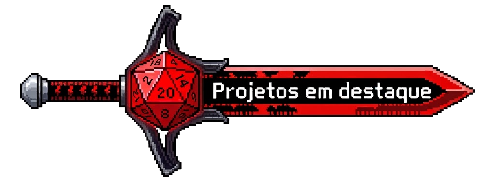

 
    
  

  
 
    
    
    

  

 

  ## SOBRE MIM
  **`Desenvolvedor Full Stack | Estudante de Engenharia de Software  FIAP (2023–2027)`**

  

  Sou desenvolvedor em formação pela FIAP, apaixonado por tecnologia, criatividade e pela criação de experiências que geram impacto. 
    Já participei de projetos e desafios para empresas como <strong>Hospital HC e Rede Âncora</strong>, aplicando tecnologia na resolução de problemas reais. 
    Tenho interesse em <strong>desenvolvimento web, storytelling e design centrado no usuário</strong>, buscando equilibrar técnica e criatividade. 
    Estou sempre em busca de novos desafios para aprender, evoluir e transformar ideias em projetos concretos.

---

 

  ## 🛠️ TECNOLOGIAS & FERRAMENTAS

  

  

    
    
    
    
    
    
  

  

    
    
    
    
    
  

  

    
    
    
    
  

---

  

  ### 🗂️ [Carebot Journey](https://github.com/PedroHMellow/Carebot-Journey-Challenge.git)
Aplicativo mobile de saúde e bem-estar desenvolvido com React Native + Expo, focado em incentivar hábitos saudáveis, acompanhar missões diárias e integrar dados de sensores IoT em tempo real.  
📦 **Stack:** React, Node.js, Express, Expo, TailwindCSS

---

